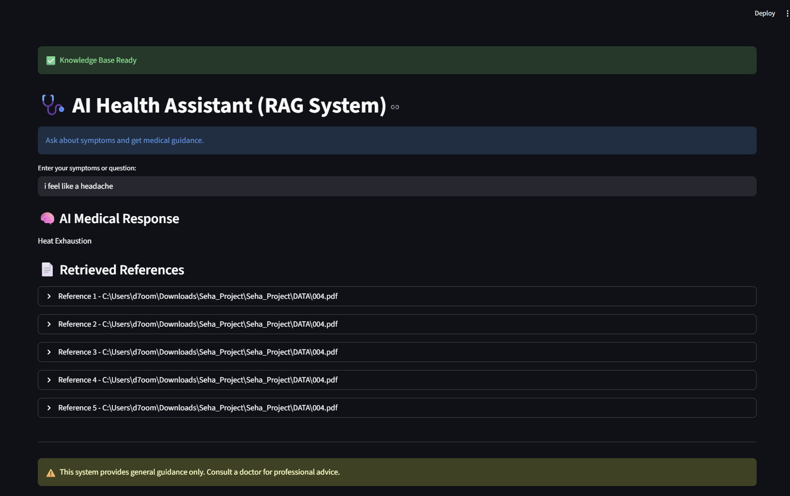

# Seha RAG Health Assistant

This is a university project prototype for an AI-powered health assistant.
It uses Streamlit for the UI and a RAG-style pipeline with FAISS, Hugging Face embeddings, and a Flan-T5 model.

## ✅ What this app does
- Loads medical PDF documents from `Seha_Project/DATA`
- Splits documents into chunks
- Builds a FAISS vector store with Hugging Face embeddings
- Runs a prompt through `google/flan-t5-base`
- Displays answers in a simple Streamlit web UI

## ▶️ Run locally
From the repository root (`Seha_Project`):

```powershell
# Create / activate the Python virtual environment
python -m venv .venv
& ".\.venv\Scripts\Activate.ps1"

# Install dependencies
python -m pip install --upgrade pip
python -m pip install -r requirements.txt

# Run the app
python -m streamlit run "Seha_Project\app.py"
```

If PowerShell blocks activation:

```powershell
python -m pip install --upgrade pip
python -m pip install -r requirements.txt
.venv\Scripts\python.exe -m streamlit run "Seha_Project\app.py"
```

## 📁 Required project structure
The app expects the following folder layout:

```text
Seha_Project/
  README.md
  requirements.txt
  .gitignore
  .venv/
  Seha_Project/
    app.py
    DATA/
      *.pdf
```

## ⚠️ Important
- Make sure `Seha_Project/DATA` contains valid PDF files.
- The app is currently configured to use CPU-based PyTorch.

## 📦 GitHub upload instructions
1. Create a GitHub repository.
2. In the local root folder, initialize git:

```powershell
git init
git add .
git commit -m "Initial project upload"
git branch -M main
git remote add origin <YOUR_GITHUB_REPO_URL>
git push -u origin main
```

3. Do not upload the virtual environment folder `.venv` or `Seha_Project/seha_env/`.
   These are ignored by `.gitignore`.

## 📸 Project Sample


## 🧠 Notes
- This repo is already a working prototype with a UI.
- To make the project submission-ready, add your PDF dataset to `Seha_Project/DATA` and confirm the app opens in the browser.

## 👤 Authors
> Designed by: [Abdulrahman Qutah, Omar Shargawi, Abdulrahman Tubiqi]  
> Date: [8 May 2026]
